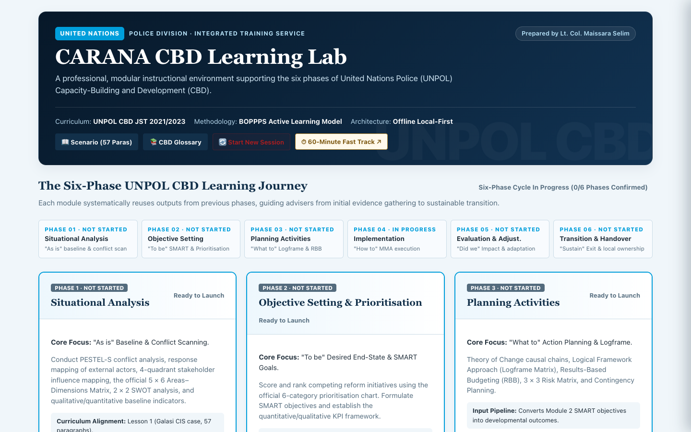
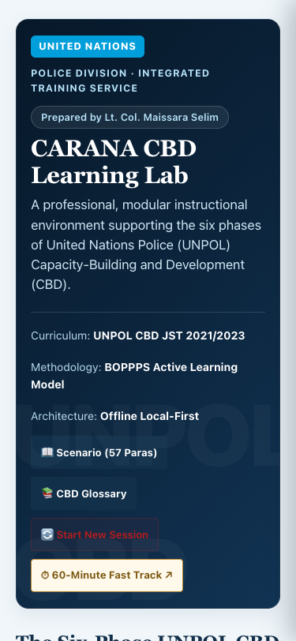
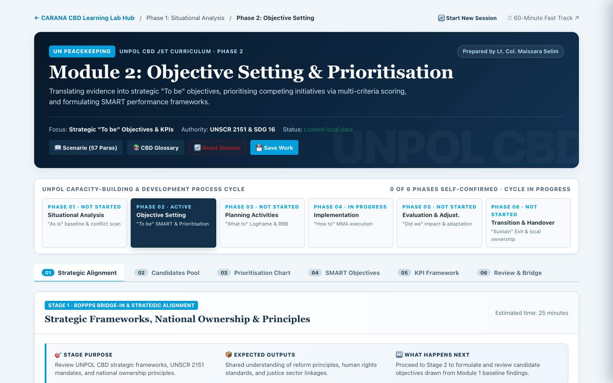
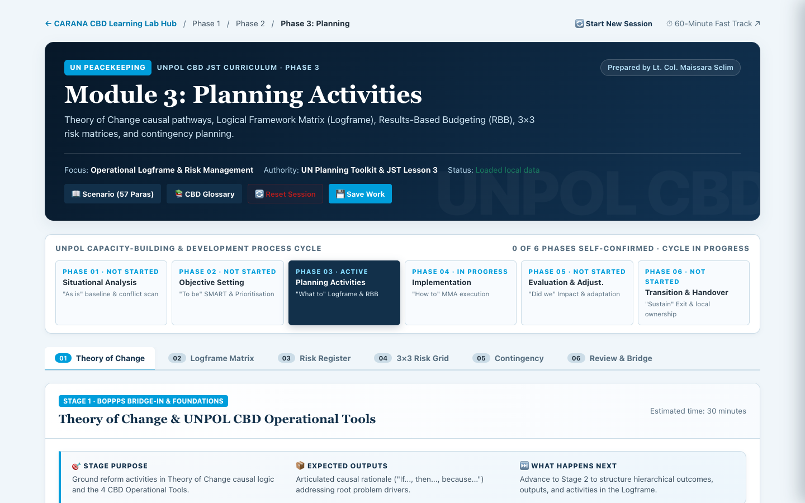
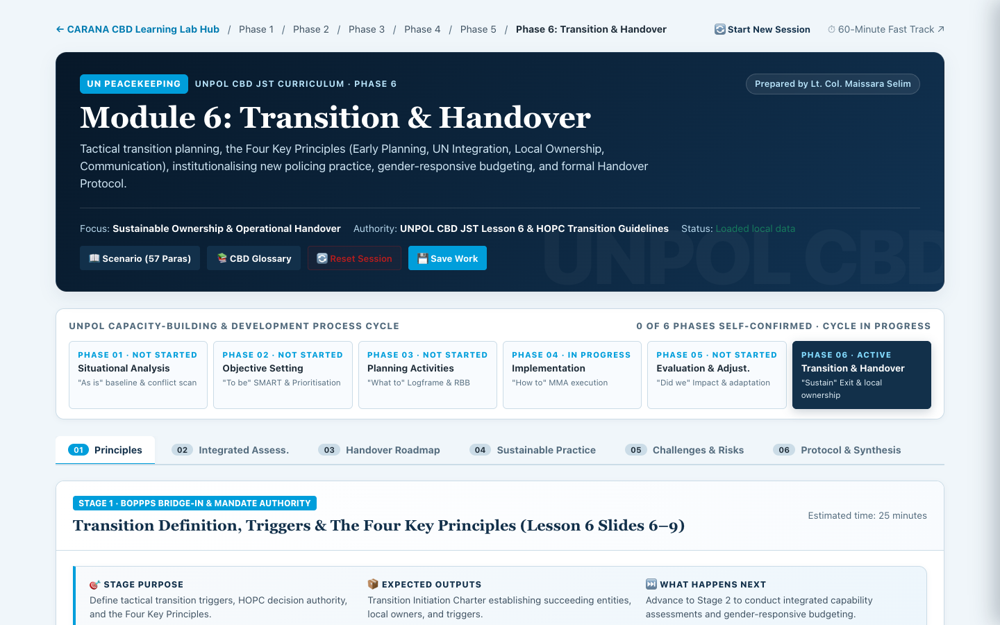
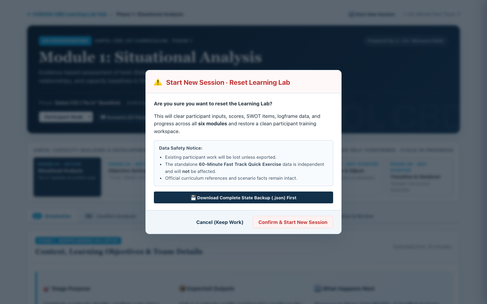
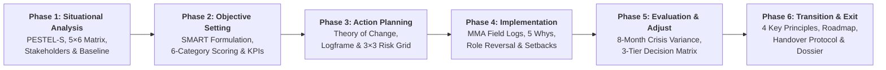

# CARANA CBD Learning Lab

> **A professional, local-first interactive simulation laboratory supporting the six phases of United Nations Police (UNPOL) Capacity-Building and Development (CBD).**

[](https://carana-cbd-group-activity.maissara.tech/)
[](https://github.com/maissaramoheb/carana-cbd-group-activity/releases)
[](https://orcid.org/0009-0004-3009-5888)
[](docs/LICENSING_AND_CREDITS.md)

---

## 1. Overview & System Purpose

The **CARANA CBD Learning Lab** is an offline-capable, local-first instructional environment designed for United Nations Police (UNPOL) personnel, international police development advisers, peacekeeping training institutions, and security sector reform (SSR) practitioners. 

The software guides learning syndicates through the complete **Capacity-Building and Development (CBD) project cycle**, translating authentic mission intelligence into evidence-based problem statements, prioritised strategic objectives, logical frameworks, implementation monitoring logs, crisis adaptation strategies, and a formal transition handover instrument.

### Author Attribution
**Prepared by Lt. Col. Maissara Selim**  
*Senior Police Planning & Training Specialist | UN Peacekeeping Operations Researcher*  
ORCID: [0009-0004-3009-5888](https://orcid.org/0009-0004-3009-5888)

---

## 2. Training Context & Fictional Scenario

### UNPOL CBD Curriculum Alignment
The Learning Lab is strictly aligned with the **United Nations Police Job-Specific Training (JST) on Capacity-Building and Development (2021/2023)** curriculum, administered by the United Nations Police Division and the Integrated Training Service (ITS) of the Department of Peace Operations (DPO). It embeds the pedagogical **BOPPPS Active Learning Model** (*Bridge-In, Objective, Pre-Assessment, Participatory Learning, Post-Assessment, Summary/Bridge-Out*) across each phase.

### The Fictional CARANA Scenario
The simulation operates entirely within the standardized, fictional **CARANA country scenario** utilized across United Nations peacekeeping training courses. Participants act as UNPOL CBD Advisers deployed to the United Nations Integrated Peacekeeping Mission in Carana (UNMIC), specifically embedded within the **Galasi City Police Station** and its **Crime Investigation Section (CIS)**. The training environment incorporates all 57 official curriculum intelligence paragraphs detailing post-conflict operational challenges, institutional corruption, infrastructure deficits, and community-oriented policing requirements.

---

## 3. Visual Interface & Design System

The platform features an institutional UN Peacekeeping visual identity (`#12304a` navy, `#007cb0` UN blue) designed for high readability, responsive field performance, and minimal eye strain during intensive workshop sessions.

| Desktop Portal Hub (1440px) | Mobile Responsive Layout (375px) |
| :---: | :---: |
|  |  |

| Module 2: Objective Setting | Module 3: Logframe & Risk Matrix |
| :---: | :---: |
|  |  |

| Module 6: Transition & Handover | Safe Session Reset Dialog |
| :---: | :---: |
|  |  |

---

## 4. Full Learning Lab vs. 60-Minute Fast-Track Quick Exercise

The repository provides two complementary instructional modes:

| Dimension | Full Six-Module Learning Lab | 60-Minute Fast-Track Quick Exercise |
| :--- | :--- | :--- |
| **Target Audience** | Full pre-deployment contingents, planning syndicates, TOT courses | Briefing seminars, executive overviews, short classroom sessions |
| **Duration** | **~14 hours of active learning** (suggested facilitation duration) | **60 minutes** (rapid single-session sprint) |
| **Learning Scope** | Complete 6-phase UNPOL CBD project cycle (36 stages) | Condensed situational diagnosis & entry-point identification |
| **Curriculum Depth** | All 6 UNPOL JST modules (Lessons 1–6) | High-level synthesis of Lesson 1 situational analysis |
| **Matrix Dimensions** | Full official 5 Areas × 6 Dimensions (78 intersections) | Condensed 5 Areas × 4 Dimensions (20 cells) |
| **Inter-Module Pipeline**| Seamless automatic data flow from baseline to handover | Self-contained single-page exercise |
| **Deliverable** | 6-Phase Master Handover Dossier with signed compact | 1-page syndicate summary printout |
| **Route / Path** | Root Hub `/` & `/module1` through `/module6` | Dedicated route `/quick-exercise` (`CARANA_CBD_Group_Activity.html`) |

> [!NOTE]  
> The legacy 60-Minute Quick Exercise (`CARANA_CBD_Group_Activity.html`) is preserved byte-identically with verified SHA-256 integrity:  
> `b1ff9a705c3faeee59000b629ae3db4aa23f9d2d7d5c8a2cef1a9872532e26d4`.

---

## 5. Overview of the Six Learning Modules

The learning lab guides syndicates systematically through six interdependent modules. Outputs generated in earlier modules automatically populate subsequent analytical tools:



### Module 1: Situational Analysis & Baseline Scanning
- **Focus:** "As-is" baseline assessment and conflict scanning.
- **Analytical Tools:** PESTEL-S conflict scan; external actor response analysis; 3 CBD perspectives (Enabling Environment, Organisational, Individual); 4-Quadrant Stakeholder Matrix; official 5 Areas × 6 Cross-Cutting Dimensions Matrix (78 cell intersections); 2 × 2 SWOT matrix; qualitative/quantitative baseline indicators.
- **Data Forwarded:** Identified baseline deficits and ranked SWOT opportunities populate Module 2 candidate objectives.

### Module 2: Objective Setting & Multi-Criteria Prioritisation
- **Focus:** Translating evidence into strategic "To-be" end-states.
- **Analytical Tools:** SSR and SDG 16 mandate alignment; official UNPOL 6-Category Objective Prioritisation Chart (Urgency, Sustainability, Feasibility, Counterpart Buy-in, Gender Equity, Impact); SMART criteria validator; KPI performance targets.
- **Data Forwarded:** Top-ranked SMART objectives become the core Developmental Outcomes in Module 3.

### Module 3: Action Planning, Logframe & Results-Based Budgeting
- **Focus:** "What to do" action planning and causal theories of change.
- **Analytical Tools:** Theory of Change causal pathways; 4 × 4 Logical Framework Approach (Logframe Matrix) with hierarchical numbering; Results-Based Budgeting (RBB) resource estimations; 3 × 3 Risk Matrix with High/Medium/Low zone calculations; contingency fallback planning.
- **Data Forwarded:** Logframe activities and indicators directly drive Module 4 implementation monitoring.

### Module 4: Implementation, Monitoring, Mentoring & Advising (MMA)
- **Focus:** "How to do it" operational field execution.
- **Analytical Tools:** Monitoring, Mentoring and Advising (MMA) field practice logs; interactive Counterpart Role Reversal simulation; dynamic problem-solving via the "5 Whys" root-cause methodology; interest-based negotiation; milestone activity tracker.
- **Data Forwarded:** Execution bottlenecks and milestone progress feed into Module 5 evaluation.

### Module 5: Evaluation, Variance Analysis & Strategic Adaptation
- **Focus:** "Did we achieve our objectives" and organizational learning.
- **Analytical Tools:** Mid-term review against Module 1 baselines; simulated 8-Month Mid-Term Crisis scenario (political polarization, budget cuts, logistical delays); KPI variance analysis (including legitimate "Exceeded" progress); UNPOL 3-Tier Adjustment Decision Matrix; 4-dimensional recalibration framework.
- **Data Forwarded:** Validated achievements and adjusted capacity baselines trigger Module 6 transition planning.

### Module 6: Transition Planning, Handover Protocol & Institutionalization
- **Focus:** "Sustaining reform" and phased operational withdrawal.
- **Analytical Tools:** Tactical transition initiation charter (distinguishing CBD activity transition from mission drawdown); application of the Four Key Principles (Early Planning, UN Integration, Local Ownership, Communication); 3-phase Handover Roadmap (Handover, Drawdown, Handback); doctrine gazetting, academy integration, and gender-responsive budgeting; formal Handover Protocol Instrument with designated signatories.
- **Final Output:** Consolidated, publication-ready Six-Module Learning Lab Master Dossier.

---

## 6. The 36 Interactive Learning Stages

Each module is broken down into 6 discrete, guided pedagogical stages:

| Module | Stage 1 | Stage 2 | Stage 3 | Stage 4 | Stage 5 | Stage 6 |
| :--- | :--- | :--- | :--- | :--- | :--- | :--- |
| **M1: Situational** | Bridge-In & PESTEL-S | Response Analysis | Stakeholder Mapping | 5×6 Areas Matrix | SWOT Analysis | Baseline Formulation |
| **M2: Objectives** | Strategic Alignment | Candidate Pool | Prioritisation Chart | SMART Objectives | KPI Framework | Review & Handover |
| **M3: Planning** | Theory of Change | Logframe Matrix | RBB Budgeting | 3×3 Risk Grid | Contingency Plans | Plan Finalisation |
| **M4: Implementation**| MMA Principles | Implementation Tracker| Role Reversal | Problem-Solving | Coordination Log | Review & Evidence |
| **M5: Evaluation** | Evaluation Framework | Baseline Comparison | Crisis Diagnostics | Variance Analysis | Decision Matrix | Strategic Recalibration |
| **M6: Transition** | Transition Principles| Integrated Assessment | Phased Roadmap | Sustainable Doctrine | Risk Safeguards | Handover Protocol & Dossier |

---

## 7. Key Architecture & Technical Capabilities

### Local-First Data Storage & Multi-Tab Synchronization
- **Zero Cloud Dependency:** Operates 100% locally in the participant's browser using `localStorage`. No accounts, passwords, external APIs, or remote databases are required.
- **Multi-Tab Concurrency:** Uses stable entity IDs (e.g. `sh-1` through `sh-8` for stakeholders, `obj-1` for objectives) and dirty-field tracking. Independent tab edits to different rows or modules synchronize automatically without data loss or infinite storage loops.
- **Corrupted Data Quarantine:** Robust error trapping catches malformed inputs or storage corruption, quarantining invalid payloads to backup keys without wiping active sessions.

### JSON Import/Export & Session Backup
- **Instant Portability:** Export the full learning lab state as a single `.json` file at any point during training.
- **Schema Validation:** Strict nested schema validator checks data structures, enum values, and field constraints upon import, rejecting malicious payloads or invalid formats.
- **Safe Session Reset:** Includes a dedicated "Start New Session / Reset Lab" dialog that forces or offers a clean `.json` export before wiping, while broadcasting a reset token to all open tabs to prevent accidental resaves.

### Comprehensive Six-Module Dossier & PDF Export
- Generates an executive, print-optimized **Master Mission Dossier** synthesizing all six modules.
- Features dynamic draft vs. participant-confirmed status watermarks, clean table splits, and SVG matrix charts.
- Preserves all syndicate-authored values without invented fallback dates or simulated data.

---

## 8. Workshop Facilitation & Training Delivery

### Recommended Duration
The recommended duration for delivering the complete Six-Module Learning Lab is approximately **14 hours of active syndicate learning** (typically structured over a 2.5-day to 3-day intensive workshop):

- **Day 1 (5.5 hrs):** Module 1 (Situational Analysis) & Module 2 (Objective Setting)
- **Day 2 (5.5 hrs):** Module 3 (Planning & Logframe) & Module 4 (Implementation & MMA)
- **Day 3 (3.0 hrs):** Module 5 (Evaluation & Crisis Adaptation) & Module 6 (Transition & Handover)

> [!NOTE]  
> This duration represents a suggested instructional pacing guide developed for optimal adult learning, syndicate debate, and plenary presentations. It is not an officially mandated UN timetable and can be adapted by facilitators according to mission needs.

### Syndicate pod & Facilitator Workflow
1. **Syndicate Pods (3–6 Participants):** Teams work collaboratively at syndicate tables, designating a Note-Taker, Facilitator Liaison, and Presenter.
2. **Plenary Milestones:** Facilitators pause the session after each module to allow syndicates to present their matrices, logframes, or risk mitigation plans.
3. **Facilitator Checklist:** Facilitators can review learner submissions, inspect completion metrics, and certify the final syndicate dossier.

---

## 9. Installation & Local Deployment

The application consists of pure, standards-compliant HTML5, CSS3, and modern ECMAScript with zero build steps, zero node runtime requirements, and zero external package dependencies.

### Option A: Local File Execution (Offline)
1. Clone the repository:
   ```bash
   git clone https://github.com/maissaramoheb/carana-cbd-group-activity.git
   cd carana-cbd-group-activity
   ```
2. Open `index.html` directly in any modern web browser (Google Chrome, Mozilla Firefox, Microsoft Edge, Safari).

### Option B: Local Web Server
Run using Python's built-in static HTTP server:
```bash
# Python 3
python3 -m http.server 8080
```
Navigate to `http://localhost:8080/` in your browser.

### Option C: Live Production Web Application
The verified application is continuously deployed and accessible globally at:  
👉 **[https://carana-cbd-group-activity.maissara.tech/](https://carana-cbd-group-activity.maissara.tech/)**  
*(Vercel mirror: [https://carana-cbd-group-activity.vercel.app/](https://carana-cbd-group-activity.vercel.app/))*

---

## 10. Automated Test Suite & Quality Verification

The repository includes a comprehensive Node.js regression test suite covering all modules, schema boundaries, concurrency protocols, and curriculum logic:

```bash
# Run the 65-test verification suite
node tests/run-tests.js
```

**Quality Gate Verification Status:**
- ✅ **65/65 tests passing** across 13 distinct verification groups.
- ✅ **100% byte-identical preservation** of `CARANA_CBD_Group_Activity.html` (`b1ff9a705c3faeee59000b629ae3db4aa23f9d2d7d5c8a2cef1a9872532e26d4`).
- ✅ **Zero external runtime dependencies**, ensuring perpetual offline reliability.

---

## 11. Citation & Academic Attribution

If you utilize, evaluate, or reference the **CARANA CBD Learning Lab** in training curricula, research publications, policy briefs, or software reviews, please cite the work as follows:

### BibTeX
```bibtex
@software{selim2026carana,
  author       = {Selim, Maissara},
  title        = {{CARANA CBD Learning Lab: An Offline-First Simulation Environment for UNPOL Capacity-Building and Development}},
  year         = {2026},
  version      = {v1.0.0},
  publisher    = {GitHub},
  url          = {https://carana-cbd-group-activity.maissara.tech/},
  repository   = {https://github.com/maissaramoheb/carana-cbd-group-activity},
  note         = {Prepared by Lt. Col. Maissara Selim. ORCID: 0009-0004-3009-5888}
}
```

### APA Format
Selim, M. (2026). *CARANA CBD Learning Lab: An Offline-First Simulation Environment for UNPOL Capacity-Building and Development* (Version 1.0.0) [Computer software]. https://carana-cbd-group-activity.maissara.tech/

See [`CITATION.cff`](CITATION.cff) for machine-readable citation metadata conforming to the Citation File Format standard.

---

## 12. Licensing, Copyright & Educational Disclaimer

### Educational Training Disclaimer
> **Official Training Aid Notice:**  
> Training aid based on the fictional CARANA scenario and UNPOL CBD JST learning materials. Official training materials remain the authoritative reference. In accordance with JST Lesson 6 (Activity 6.1), transition planning specifically addresses the programmatic handover and sustainability of the bilateral Capacity-Building and Development (CBD) activity to host-state authorities and development partners, rather than the political withdrawal or overall liquidation of the wider UN peacekeeping mission.

### Intellectual Property & Terms of Use
- **Original Software & Instructional Architecture:** The software code, client-side data pipelines, UI design system, concurrency handlers, and interactive learning mechanisms are Copyright © 2026 Maissara Selim (`Prepared by Lt. Col. Maissara Selim`).
- **United Nations Training Materials:** The underlying CARANA scenario, peacekeeping doctrine references, and UNPOL Job-Specific Training (JST) pedagogical frameworks are the intellectual property of the United Nations (Department of Peace Operations / Integrated Training Service / Police Division) and are referenced herein strictly for instructional simulation and educational capacity-building purposes.
- For complete terms regarding non-commercial educational reuse, see [docs/LICENSING_AND_CREDITS.md](docs/LICENSING_AND_CREDITS.md).
